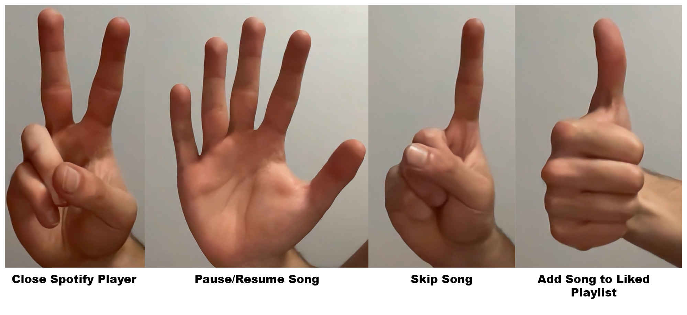

# Spotify Vision

## Introduction

Spotify Vision is a project I created that allows users to control their Spotify Player using hand gestures. It leverages the Spotify API and computer vision technology. I trained an AI model using the Ultralytics YOLOv8 model to accurately recognize various hand gestures. These gestures include pausing and resuming a song, adding a song to a liked playlist, skipping a song, and closing the Spotify Player after use. In this article, I will provide instructions on how to successfully run the code.
For a more detailed guide, visit [my website](https://sebastiankrzysiak.me/spotify-vision).

## Spotify API Setup

To use the Spotify API, you must have a [**Spotify account**](https://www.spotify.com/us/signup) with [**Spotify Premium**](https://www.spotify.com/us/premium/), which is a subscription-based service. If you are a [**student**](https://www.spotify.com/us/student/), you can use your university email to get a discount. Once you have created a Spotify Premium account, we will need to get the **Client ID** and **Client Secret** in order to access the API with our Python code.

1. Navigate to the [**Dashboard**](https://developer.spotify.com/dashboard) page on the Spotify for Developers site
2. Click on the "Create App" button
3. Provide a name and description for your app
4. Set the "Redirect URIs" to **http://localhost:8888/callback** and **http://localhost:8080** in the text field
5. All the other fields can be left alone
6. Check mark the agreement box
7. Click the "Save" button

You will be automatically redirected to the Home page. Then, click on the "Settings" button located in the top right corner. This action will take you to the Basic Information page. On this page, please make sure to write down your **Client ID**. Additionally, you will need your **Client Secret**, so simply click on the "View client secret" link and take note of it.

## Code Setup

In this section, we will set up the code to run the Spotify Vision project.

1. Create a virtual Python environment using either [**venv**](https://www.freecodecamp.org/news/how-to-setup-virtual-environments-in-python/) or [**conda**](https://www.geeksforgeeks.org/set-up-virtual-environment-for-python-using-anaconda/).
2. Clone the project from [**GitHub**](https://github.com/sebastiankrzysiak/Spotify-Vision).
3. Install the required libraries using the following command: **pip install -r requirements.txt**.
4. Open the **spotifyvision.py** file and replace the **CLIENT_ID** and **CLIENT_SECRET** with the ones you obtained from the Spotify API.

## Running the Code

Before running the code, make sure to have your Spotify Player open (either on the desktop website or app).

1. Run the code using the following command: **python3 main.py**.
2. Select any available device shown in your list
3. Select any available playlist shown in your list

After selecting a playlist, a song will start playing from it. The terminal will display the currently playing song.

## Hand Gestures

The following hand gestures can be used to control the Spotify Player:

